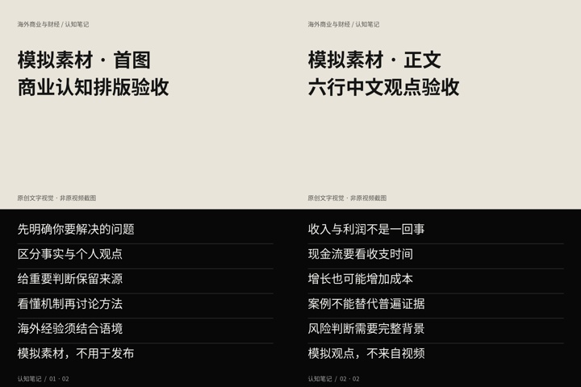

# YouTube 商业与财经卡片项目

这里用来保存油管视频的中文卡片、完整文案、来源和制作记录。你可以直接在 GitHub 页面查看，无需安装软件。

## 看卡片与文案

| 内容 | 状态 | 查看 |
|---|---|---|
| 模拟素材：商业认知卡片排版测试 | 首图、正文图与文案已完成；不是视频内容，不可发布 | [打开图片和文案](./output/visual-acceptance-simulated/README.md) |
| 油管视频 Ktu6nSWtdS0 | 云端访问受阻，尚未取得视频标题、字幕及真实文案 | [查看制作进度](./output/Ktu6nSWtdS0/analysis.md) |

以后取得真实视频内容后，条目会使用实际视频标题，例如“某某油管视频——卡片与中文文案”。当前不能编造该视频的标题或内容。

## 模拟素材预览

[查看大图和逐条文案](./output/visual-acceptance-simulated/README.md)

## 项目说明

默认图片 1440×1920，上方原创文字视觉、下方黑底白字知识区域。本次测试不使用第三方视频截图。

[技术与编辑说明](./项目说明.md) · [返回仓库首页](../../README.md)
