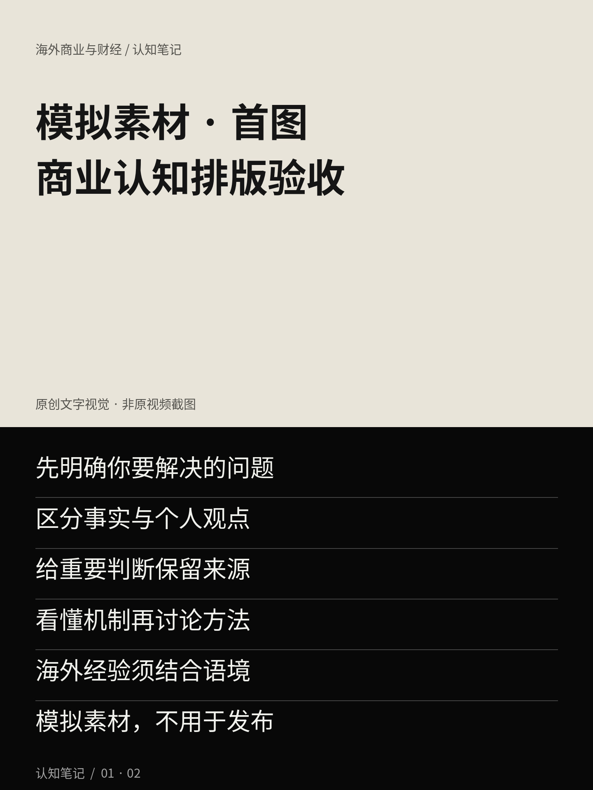
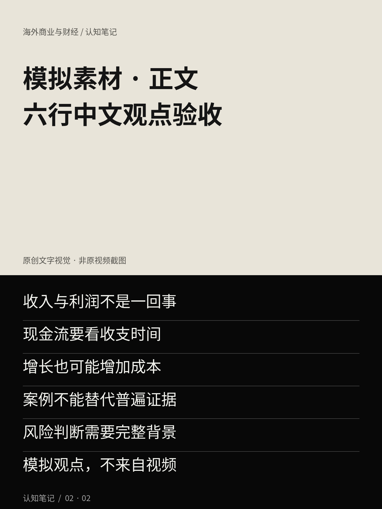

# 模拟测试：商业认知卡片与中文文案

**全部图片和文字均为模拟排版素材，不来自 YouTube 视频，不得作为真实视频内容发布。**

## 两张卡片预览

## 第一张：首图

标题：模拟素材 · 首图 / 商业认知排版验收

六行文案：

1. 先明确你要解决的问题
2. 区分事实与个人观点
3. 给重要判断保留来源
4. 看懂机制再讨论方法
5. 海外经验须结合语境
6. 模拟素材，不用于发布

## 第二张：正文卡片

标题：模拟素材 · 正文 / 六行中文观点验收

六行文案：

1. 收入与利润不是一回事
2. 现金流要看收支时间
3. 增长也可能增加成本
4. 案例不能替代普遍证据
5. 风险判断需要完整背景
6. 模拟观点，不来自视频

## 图片参数与检查

两张原图均为 JPG，1440×1920；预览为 720×480。A 版 hero_fraction=0.54，正文 58px，标题 94px；Noto Sans CJK 字体，灰色分隔线 2px。原 Skill 未找到，不能宣称像素级复现。

[渲染参数](./render-config.json) · [质检记录](./qa-report.md) · [返回卡片项目](../../README.md)
